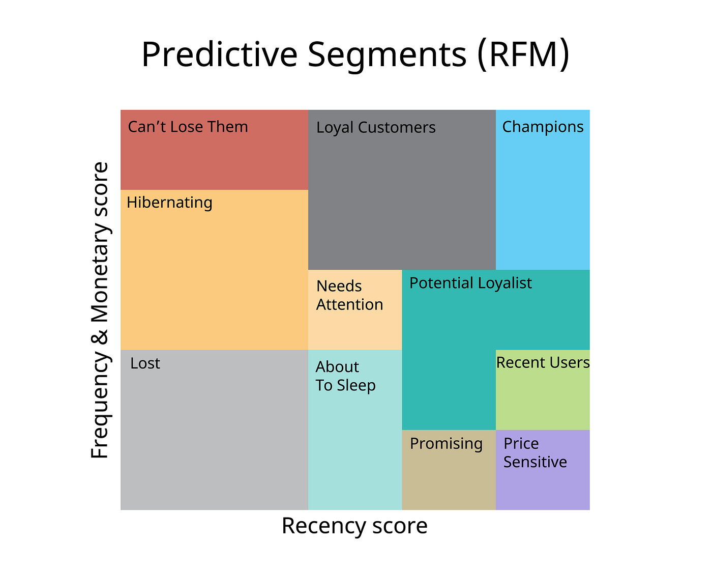
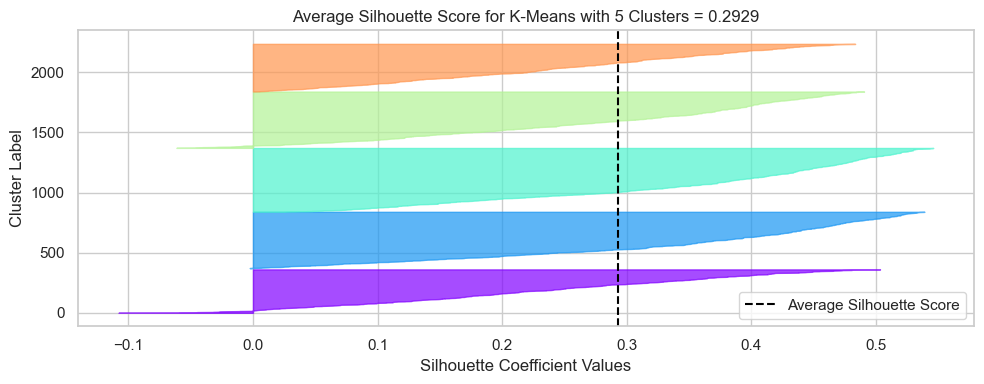
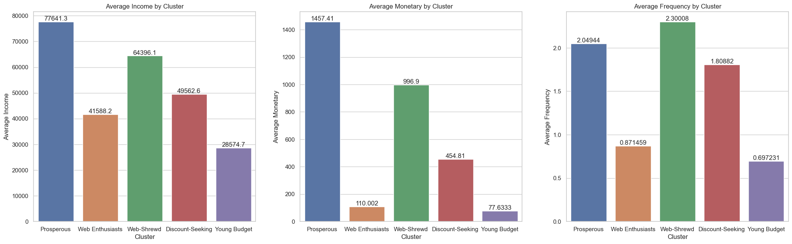
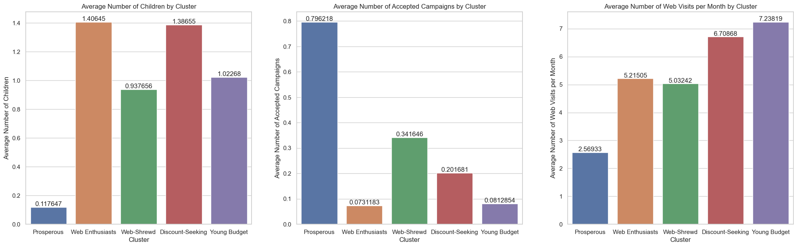
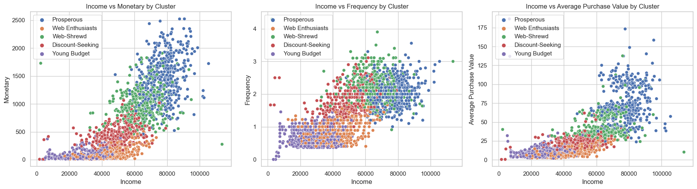

# Retail Store Customer Segmentation and Profiling

# 1. Description
- In this project, I performed an <b>unsupervised learning clustering task using K-Means</b> on unlabeled training data to segment and profile customers for a retail store. 
- After segmenting the clients, a <b>loyalty program called "Prosperous"</b> was developed based on the profile of our best customers, the Prosperous ones. 
- By utilizing techniques such as <b>dimensionality reduction and silhouette score analysis</b> for model comparison and cluster definition, I was able to effectively segment the clientele into five groups, creating distinct personas. 
- Finally, a <b>financial estimate</b> was made. The <b>loyalty program</b> has the potential to <b>increase the total store revenue by 9%, amounting to $125,228.55.</b> Therefore, the project is worthwhile.
- The project follows a <b>real data science project workflow</b>, encompassing tasks from data collection and exploratory data analysis (EDA) to final modeling. It includes <b>features</b> like exception handling, virtual environments, modular coding, code versioning (using Git and Github), and specifying project requirements. By structuring it this way, I've organized the entire project as a package, making it easily reproducible by others.

# 2. Technologies and tools
The technologies and tools used were Python (Pandas, Numpy, Matplotlib, Seaborn, Scikit-Learn), Jupyter Notebook, Git and Github (version control), machine learning clustering algorithms, statistics, Anaconda (terminal and virtual environment) and Visual Studio Code (project development environment).

# 3. Project Structure
Each folder/file content and purpose is described below:

<b>Artifacts:</b> Store machine learning model artifacts, including the raw data, preprocessed data, the preprocessor, and the model.

<b>Notebooks:</b> 
- eda.ipynb: This notebook contains the exploratory data analysis.
- modelling.ipynb: This notebook covers the clustering machine learning modeling.
- data: This folder contains the raw data to be used in notebooks.

<b>Reports:</b> Store some images that are used for storytelling.

<b>Scripts:</b> Store utility scripts used for EDA, modeling, exception handling, and artifacts retrieval. The files names are self explainable.
- artifacts_utils.py
- eda_utils.py
- exception.py
- modelling_utils.py

<b>Requirements, setup, gitignore, readme:</b> The file setup.py allows me to build my entire project as a package, containing metadata and so on. Moreover, requirements.txt list all the dependencies needed for the project with the specific versions for reproducibility. Gitignore allows me to hide irrelevant information from commits and I am using readme.md for documentation and storytelling.

# 4. Business problem and project objectives

Problem statement:
- A <b>retail store</b> aims to gain a deeper understanding of its customer characteristics and to strategically utilize this knowledge. One of its primary goals is to proficiently <b>segment its clientele</b>, allowing for enhanced comprehension of its customers' preferences. This, in turn, facilitates the adaptation of products to cater to the unique requirements, behaviors, and concerns of various customer segments.
- Additionally, the store wants to build better connections with customers and keep them coming back by starting a <b>loyalty program.</b> They'll look closely at how customers behave, what they buy, and what they like. Then, they'll create a loyalty program with special rewards and benefits just for different groups of customers. This special treatment doesn't just keep customers coming back; it also makes them feel valued and part of the store's family, which makes them like the brand even more.

Considering everything mentioned above, the <b>project objectives</b> are:

1. Identify <b>customer groups</b> and create <b>profiles</b> for them. By doing this, it will be possible to assess common characteristics of client segments, such as product preferences and demographic information.
2. Design a <b>loyalty program</b> based on an ideal customer group with the intention of improving client retention and increasing revenue.
3. Achieve satisfactory <b>financial results</b> through customer segmentation and the loyalty program, which will be estimated in final steps.

By doing this, the business problem will be resolved.

# 5. Solution pipeline
The following <b>pipeline</b> was used, based on <b>CRISP-DM</b> framework:

1. Define the business problem.
2. Initial data understanding.
3. Exploratory data analysis and feature engineering (based on RFM model).
4. Data cleaning and preprocessing.
5. Group customers into clusters, modelling.
6. Analyze the groups created, profiling them (personas).
7. Develop the loyalty program.
8. Estimate financial results.

# 6. RFM model

I used the <b>RFM model</b> for clustering analysis. 

The RFM model is a marketing and customer segmentation technique used to analyze and categorize customers based on their recent purchasing behavior. RFM stands for:

- <b>Recency:</b> This measures how recently a customer has made a purchase. Customers who have made a purchase more recently are typically considered more valuable.
- <b>Frequency:</b> This measures how often a customer makes purchases. Customers who make frequent purchases are often more engaged and loyal.
- <b>Monetary Value:</b> This assesses the amount of money a customer has spent on purchases. Customers who have spent more are usually considered higher-value customers.

By analyzing these three factors, businesses can <b>categorize their customers into different segments</b>, such as "high-value and highly engaged" or "low-value and inactive." This segmentation allows companies to tailor their marketing strategies and offers to each group more effectively, ultimately improving customer retention and maximizing revenue.

# 7. Clustering
1. A massive <b>feature engineering</b> was made based on the RFM model and some insights in order to extract the maximum information from the available attributes. For <b>preprocessing</b>, since the education exhibit an ordinal relationship and marital status had just two categories, which would be encoded as 0/1, I chose <b>OrdinalEncoder</b> for encoding them. Moreover, for missing values imputing, I chose <b>KNNImputer</b> in order to avoid biased clustering results, such that the mean of the 5 nearest neighbors was assigned to income null observations. Finally, once clustering algorithms use distance calculations such as euclidean distance, meaning they are sensitive to features' scale, I applied <b>StandardScaler</b> to all of the variables. 
2. I applied <b>dimensionality reduction</b> using <b>PCA</b> in order to reduce some noise in the data, which facilitated better clustering. I tested different numbers of principal components to use and even without PCA, and using 3 components was not only effective for segmentation but also led to higher silhouette scores and allowed cluster visualization in a 3D space.
3. I chose three <b>clustering algorithms for performance comparison:</b> <b>K-Means, Gaussian Mixture Model, and Hierarchical Clustering</b>, while analyzing the <b>silhouette scores</b> for a range of cluster numbers
4. <b>K-Means</b> was the <b>optimal</b> choice, reaching the highest silhouette scores and the best segmentation. Therefore, I selected it for the final model training and customer segmentation. Furthermore, the <b>silhouette plot</b> indicated that with <b>k=5</b>, most of the instances extended beyond the dashed line to the right, and the clusters had similar sizes. Thus, I trained K-Means with five clusters.

5. After training K-Means with five clusters, I created a <b>3D plot to visualize the clusters.</b> The plot demonstrates a clear separation between the different groups formed, further affirming the quality of the K-Means clustering.

6. Next, I analyzed the <b>clusters</b> that were formed and assigned <b>profiles</b> to them based on their demographic information and purchasing behaviors. These five clusters were given the following names and summaries:

<b>Prosperous Shoppers:</b>
- This cluster comprises customers with a relatively high average income, moderate frequency, and substantial monetary spending.
- They prefer in-store and catalog purchases and tend to visit the web less frequently.
- They are open to accepting campaign offers and typically have no children.

<b>Web-Shrewd Shoppers:</b>
- Customers in this cluster have a decent income, a good frequency of purchases, but lower monetary spending.
- They prefer both store and web purchases, and they make a considerable number of web visits each month.
- Some are receptive to campaigns, and many have one child.

<b>Discount-Seeking Web Shoppers:</b>
- This cluster consists of customers with a lower income, lower frequency of purchases, and lower monetary spending.
- They prefer web purchases with discounts and frequently visit the website.
- Most have one or more children, and they are not very likely to accept campaigns.

<b>Web Enthusiasts with Frugal Habits:</b>
- Customers in this cluster have a relatively low income, low frequency, and modest monetary spending.
- They visit the website frequently but do not make many purchases.
- Many have one or more children, and they are not particularly inclined to accept campaigns.

<b>Young Budget Shoppers:</b>
- This cluster includes younger individuals with lower income, low frequency, and low monetary spending.
- They visit the website often but make relatively small purchases.
- Most have one child, and they are not receptive to campaigns.

- Surprisingly, the clusters formed didn't show any differentiation with respect to recency.

Below, the <b>table summarizes</b> all the <b>information</b> about <b>each cluster</b> formed.

| cluster          | monetary | frequency | recency | income | avg_purchase_value | numdealspurchases | numwebpurchases | numcatalogpurchases | numstorepurchases | numwebvisitsmonth | total_accepted_cmp | children | age  | relationship_duration | count | percentage |
|------------------|----------|-----------|---------|--------|--------------------|-------------------|-----------------|----------------------|-------------------|-------------------|--------------------|----------|------|-----------------------|-------|------------|
| Prosperous       | 1457.41  | 2.05      | 50.05   | 77641.28 | 74.02              | 1.06              | 4.89            | 6.07                 | 8.32              | 2.57              | 0.80               | 0.12     | 54.16 | 9.95                  | 476   | 21.36      |
| Web-Shrewd       | 996.90   | 2.30      | 49.34   | 64396.09 | 43.94              | 3.02              | 6.76            | 4.40                 | 9.06              | 5.03              | 0.34               | 0.94     | 57.92 | 10.13                 | 401   | 18.00      |
| Discount-Seeking | 454.81   | 1.81      | 48.05   | 49562.64 | 24.41              | 4.57              | 5.95            | 1.91                 | 6.01              | 6.71              | 0.20               | 1.39     | 56.78 | 10.23                 | 357   | 16.02      |
| Web Enthusiasts | 110.00   | 0.87      | 49.72   | 41588.22 | 11.59              | 1.81              | 2.05            | 0.69                 | 3.62              | 5.22              | 0.07               | 1.41     | 57.74 | 9.38                  | 465   | 20.87      |
| Young Budget     | 77.63    | 0.70      | 48.24   | 28574.70 | 10.37              | 1.86              | 1.94            | 0.42                 | 2.90              | 7.24              | 0.08               | 1.02     | 46.20 | 10.22                 | 529   | 23.74      |

Some <b>barplots</b> to <b>illustrate the table information:</b>

Some <b>scatterplots</b> to <b>illustrate the clusters separation</b> in different income, monetary, frequency and average purchase values:

# 8. Loyalty program development
- I selected the most valuable clients for the loyalty program, the <b>Prosperous customers</b>. The loyalty program was named "Prosperous" as well.
- To <b>boost revenue</b> after implementing the loyalty program, strategies such as offering discounts, exclusive products, and targeted marketing campaigns can be employed.

Who is <b>eligible</b> to participate in the Prosperous loyalty program?
- Prosperous customers, representing 21.4% of my total clientele.

Which are the main <b>characteristics</b> of this group?
- Customers with a relatively high average income, moderate frequency, and substantial monetary spending.
- They prefer in-store and catalog purchases and tend to visit the web less frequently.
- They are open to accepting campaign offers and typically have no children.
- The Prosperous cluster generates approximately 51% of the total customer's revenue.
- The Prosperous cluster buys 1.38 times more frequent compared to the total of customers.
- The Prosperous cluster represents the second highest percentage of the total customers base. Particularly, it includes 21.4% of the clientele.
- Prosperous customers accept, on average, 2.67 times more campaigns compared to the total customer base.

# 9. Financial results
- I estimated <b>concrete financial results</b> that our <b>loyalty program</b>, developed based on customer segmentation clustering modeling, could yield.
- I supposed that with targeted marketing campaigns, personalized products and special offerings, the retail store can increase the Prosperous customers revenue in 15%. 
- Given the similarity between Web-Shrewd customers and Prosperous ones, I assumed a 30% conversion rate for this group to become Prosperous.
- Considering that the other groups differ more from Prosperous customers, I assumed the following conversion rates to Prosperous: Discount-Seeking Web Shoppers = 10%; Web Enthusiasts with Frugal Habits = 8%; Young Budget Shoppers = 5%.

<b>Financial results:</b>
- Total revenue before Prosperous loyalty program: $1,348,072.00.
- Total revenue after Prosperous loyalty program: $1,473,300.55
- Revenue increased by <b>9.00%.</b>
- Revenue increased in <b>$125,228.55.</b>

Wow! The <b>project is indeed worthwile.</b> These results illustrate the power of machine learning and data science.

# 10. Run this project on your local machine
To <b>run the notebooks locally</b>, make sure to have installed:

1. Python 3.11.4
2. pip (Python package manager)
3. Git (Version control tool)
4. Jupyter (Run the notebooks)

Once you have this installed, open a terminal on your local machine and run the following commands:

1. Clone the repository:
<pre>
git clone https://github.com/allmeidaapedro/Customer-Segmentation-Retail.git
</pre>

2. Navigate to the cloned repository directory:
<pre>
cd Customer-Segmentation-Retail
</pre>

3. Create a virtual environment:
<pre>
python -m venv venv
</pre>

4. Activate the Virtual Environment:

Activate the virtual environment used to isolate the project dependencies.
<pre>
source venv/bin/activate  # On Windows, use 'venv\Scripts\activate'
</pre>

5. Install Dependencies:

Use pip to install the required dependencies listed in the requirements.txt file.
<pre>
pip install -r requirements.txt
</pre>

6. Start Jupyter Notebook:

To start Jupyter Notebook, run the following command:
<pre>
jupyter notebook
</pre>
This will open a new tab or window in your web browser with the Jupyter Notebook interface.

7. Navigate to the 'notebooks' folder:

Use the Jupyter Notebook interface to navigate to the 'notebooks' folder within your project directory.

8. Open and Run Notebooks:

You should see the 'eda.ipynb' and 'modelling.ipynb' notebooks listed. Click on the notebook you want to run to open it. Once it's open, you can run individual cells or the entire notebook by clicking the "Run" button.

9. Deactivate the Virtual Environment (Optional):

When you're done working with the notebooks and want to exit the virtual environment, you can deactivate it using the following command:

<pre>
deactivate
</pre>

# 11. Dataset link
The dataset was collected from <b>kaggle.</b>

Link: https://www.kaggle.com/datasets/imakash3011/customer-personality-analysis

# 12. Contact me
<b>Linkedin:</b> https://www.linkedin.com/in/pedro-almeida-ds/

<b>Github:</b> https://github.com/allmeidaapedro

<b>Gmail:</b> pedrooalmeida.net@gmail.com
